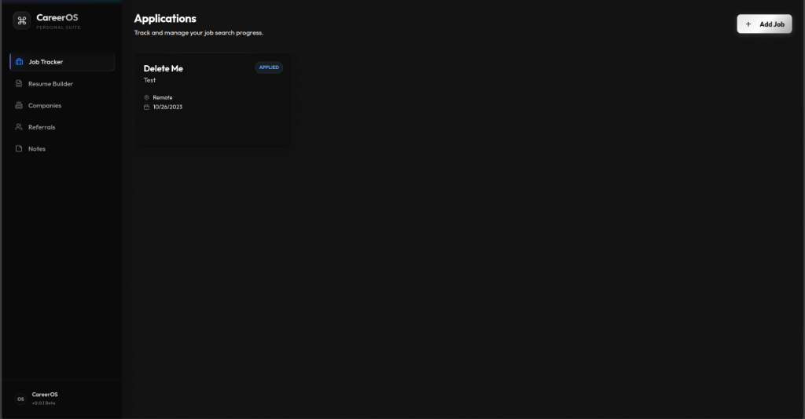
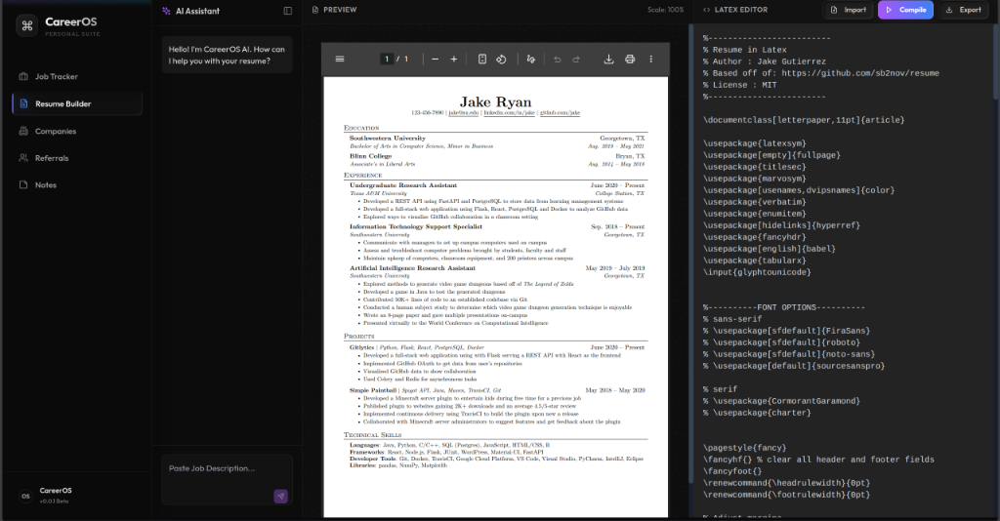
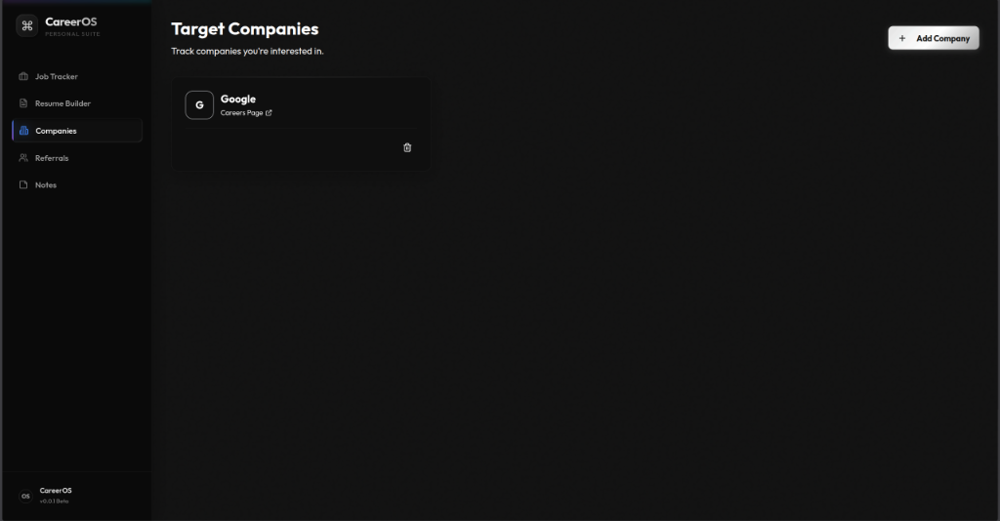
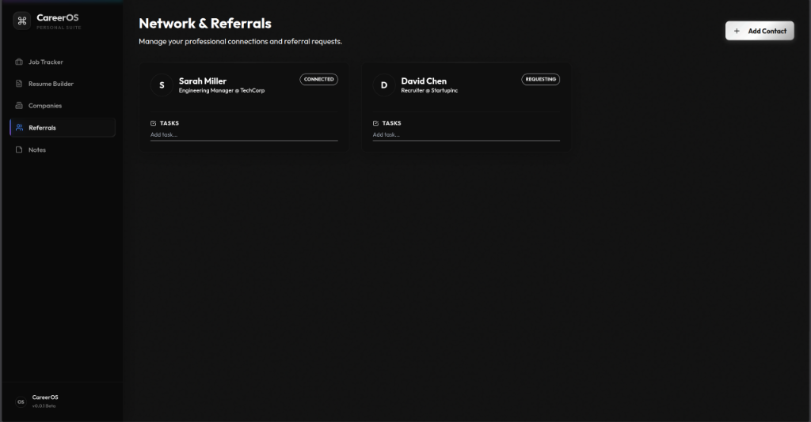
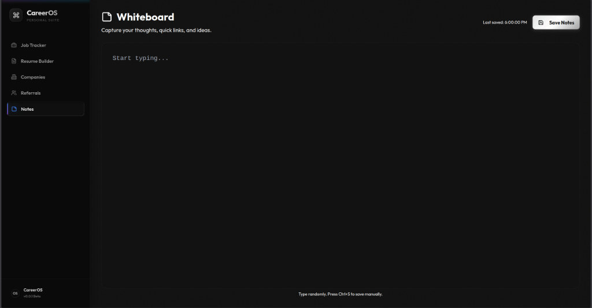
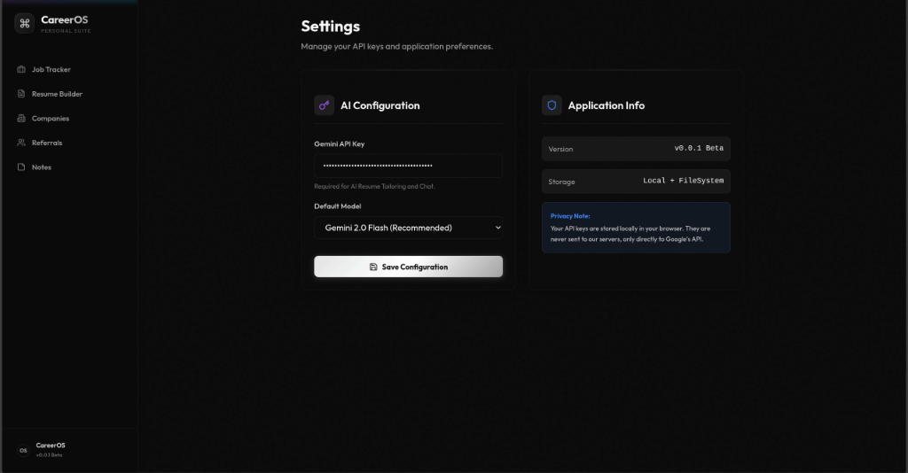

# CareerOS

**CareerOS** is an AI-powered job application tracking and resume building platform. It helps you manage your job search, track applications, and tailor your resume for specific job descriptions using generative AI.

## Features

-   **Job Tracker**: Kanban-style board to track applications (Applied, Interviewing, Offer, Rejected).
-   **AI Resume Builder**: Create and edit LaTeX resumes with a live preview.
-   **AI Tailoring**: Automatically tailor your resume content to match a specific Job Description using Google's Gemini AI.
-   **Networking**: Manage professional contacts and companies.

## Screenshots

### Job Tracker

*Kanban-style board to manage applications through different stages*

### AI Resume Builder

*LaTeX editor with live PDF preview and AI-powered tailoring*

### Target Companies

*Track companies you're interested in*

### Network & Referrals

*Manage professional connections and referral requests*

### Whiteboard Notes

*Capture thoughts, links, and ideas*

### Settings

*Configure your Gemini API key and preferences*

## Prerequisites

-   **Node.js** (v18 or higher) - [Download](https://nodejs.org/)
-   **Python** (v3.10 or higher) - [Download](https://www.python.org/downloads/)
-   **Google Gemini API Key** (Required for AI features) - [Get it here](https://aistudio.google.com/app/apikey)

## Setup Instructions

### 1. Install LaTeX (Required for PDF generation)

**Linux (Debian/Ubuntu):**
```bash
sudo apt-get install texlive-latex-base texlive-fonts-recommended texlive-fonts-extra texlive-latex-extra
```

**Linux (Fedora):**
```bash
sudo dnf install texlive-scheme-basic texlive-collection-latexextra texlive-titlesec
```

**Windows:**
1. Download and install [MiKTeX](https://miktex.org/download) or [TeX Live](https://www.tug.org/texlive/).
2. During installation, enable "Install missing packages on-the-fly".
3. Restart your terminal to refresh the PATH.

**macOS:**
```bash
brew install --cask mactex-no-gui
```

### 2. Start the Application

#### Linux/macOS:
Run the startup script:
```bash
chmod +x start_server.sh
./start_server.sh
```

#### Windows:
Double-click `dev.bat` or run in Command Prompt:
```cmd
dev.bat
```

This will:
1.  Install backend dependencies (if needed).
2.  Start the Backend server on `http://localhost:8081`.
3.  Start the Frontend server on `http://localhost:5173`.

### 3. Configure API Key
Once the application is running:
1.  Open your browser to [http://localhost:5173](http://localhost:5173).
2.  Go to the **Settings** page (Sidebar > Settings).
3.  Enter your **Gemini API Key**.
4.  Click **Save**.

*Note: You can get a free API key from [Google AI Studio](https://aistudio.google.com/app/apikey).*

## Usage

-   **Dashboard**: Overview of your application status.
-   **Job Tracker**: Add new jobs, drag and drop to change status, and view details.
-   **Resume Builder**:
    -   Write your resume in LaTeX (or use the template).
    -   Click **Compile** to see the PDF preview.
    -   Paste a Job Description in the **AI Chat** and click **Send** to tailor your resume.
    -   Click **Download PDF** to save your resume.

## Troubleshooting

-   **Backend not starting?** Check `backend.log` for errors.
-   **AI Tailoring error 403?** Ensure your Gemini API key is valid and the "Generative Language API" is enabled in your Google Cloud Console project.

## Development

-   **Backend**: `backend/app/` (FastAPI)
-   **Frontend**: `frontend-react/src/` (React + TypeScript + Tailwind)

## About

**CareerOS** is an open-source job application management system designed to streamline your job search workflow. Built with modern web technologies, it combines powerful AI capabilities with an intuitive interface to help you track applications, manage professional connections, and create ATS-optimized resumes.

### Tech Stack

**Frontend:**
- React 18 with TypeScript
- Vite for fast development
- Tailwind CSS for styling
- PDF.js for resume previews

**Backend:**
- FastAPI (Python)
- SQLAlchemy ORM
- Google Gemini AI (2.0 Flash)
- LaTeX for PDF generation

**AI Features:**
- Resume parsing from PDF/DOCX
- Intelligent LaTeX conversion
- Job description tailoring
- ATS optimization

### License

MIT License - feel free to use, modify, and distribute as needed.

### Author

Created by [Drupadh](https://github.com/Drupadh)

---

**Star ⭐ this repo if you find it useful!**
